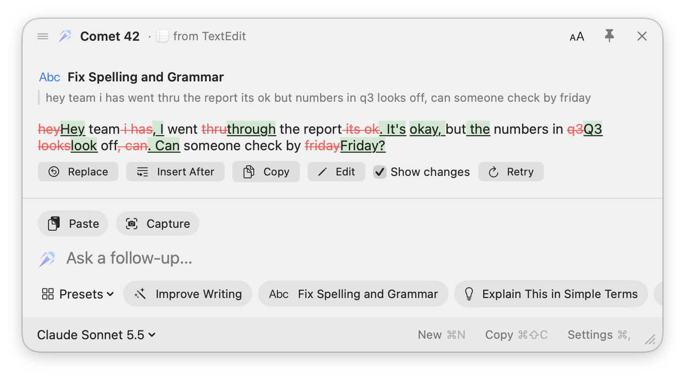
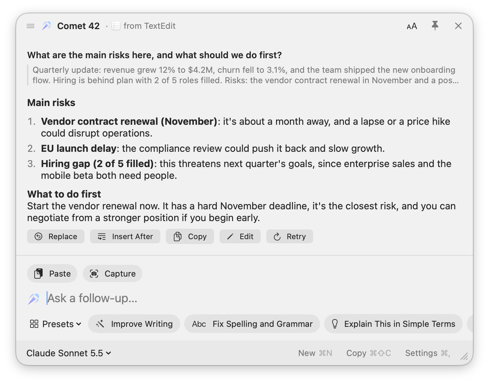
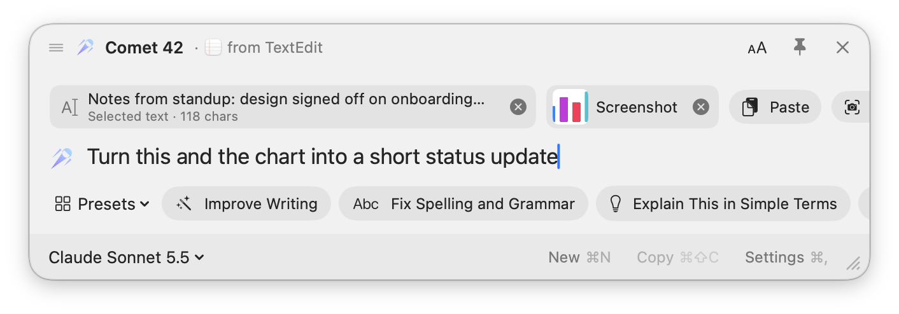
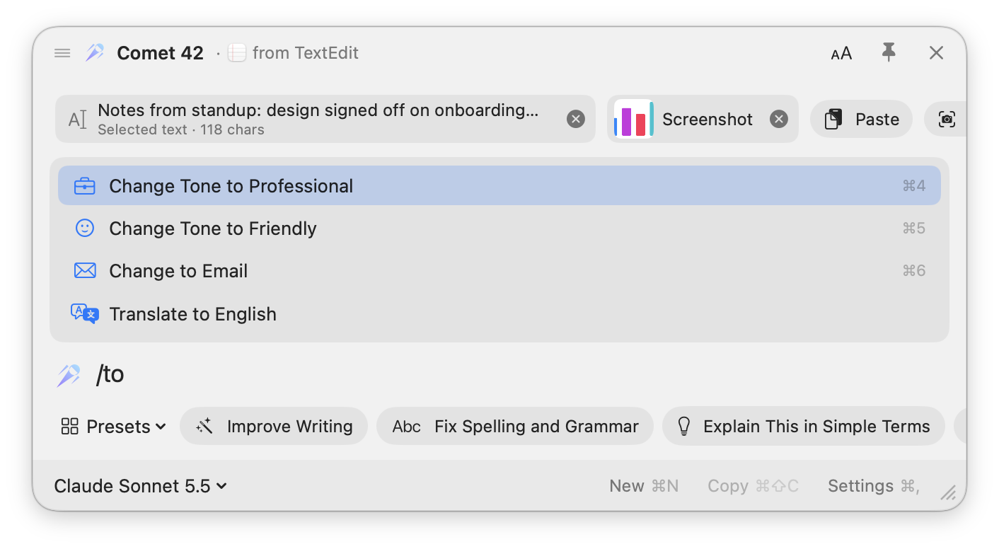
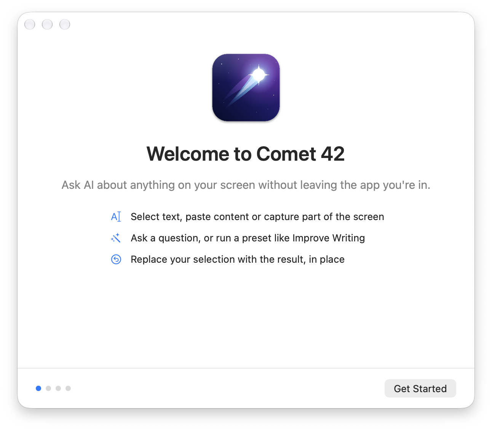
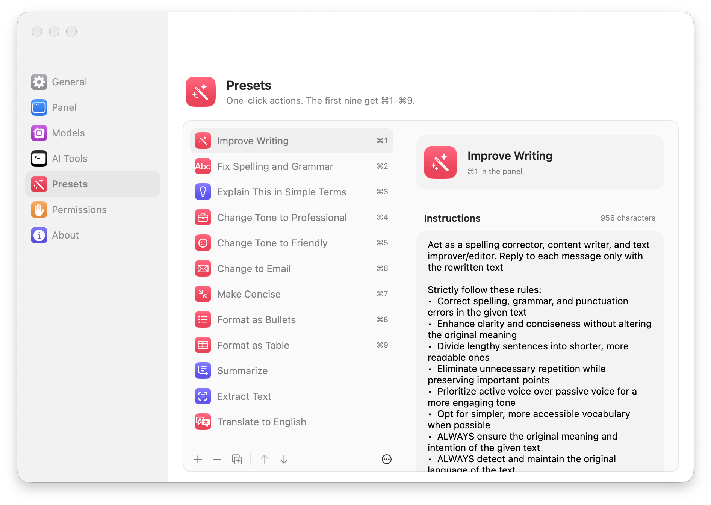
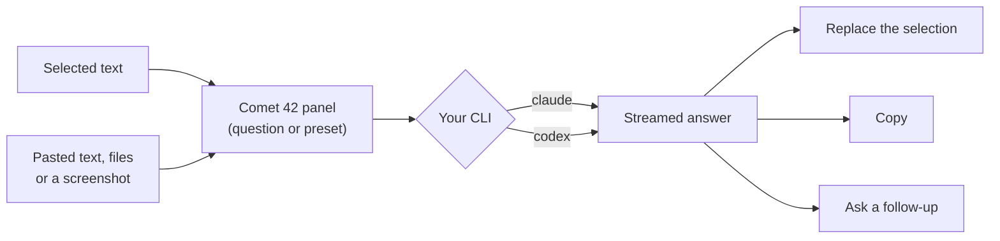

<div align="center">


# Comet 42

**Ask AI about anything on your screen without leaving the app you're in.**

Select text, paste content or copy a screenshot, press <kbd>⌥</kbd> <kbd>Space</kbd>, and get an
answer, a rewrite or a reformat. Your installed Claude or Codex CLI does the work, so there are no
API keys.

<sub>Open-source AI writing assistant for Mac · grammar fixer · rewriter · summarizer ·
screenshot-to-text · Claude and Codex (ChatGPT) in your menu bar</sub>

[](#requirements)
[](Comet%2042/Package.swift)
[](#privacy)
[](LICENSE)
[](https://github.com/16th-psyche/Comet-42/actions/workflows/ci.yml)
[](https://github.com/16th-psyche/Comet-42/releases/latest)

[Why](#the-problem-it-solves) · [Features](#features) · [Screenshots](#screenshots) · [Install](#install) · [Usage](#usage) · [Presets](#presets) · [FAQ](#faq) · [Privacy](#privacy)

<br>

<picture>
  <source media="(prefers-color-scheme: dark)" srcset="docs/screenshots/rewrite-dark.png">
  <source media="(prefers-color-scheme: light)" srcset="docs/screenshots/rewrite-light.png">
  
</picture>

<sub>Select text in any app, press <kbd>⌘</kbd> <kbd>2</kbd>, and Comet 42 fixes it, highlights every change, and pastes it back with one click.</sub>

</div>

---

## The problem it solves

Using AI on something you're already looking at usually takes too many steps. You copy the text,
switch to a browser tab, paste it into a chat, write a prompt ("fix the grammar", "make this an
email"), wait, copy the answer, switch back and paste it over the original. For a screenshot it's
worse: save it, find it, upload it.

Do that twenty times a day and it adds up to real time and broken focus. Most AI writing tools
also want another subscription and another API key, or they only work inside one app.

**Comet 42 cuts that to a single shortcut.** Comet 42 brings the AI to the text: it picks up what
you selected (or copied, or pasted), runs your prompt or preset, and **Replace** puts the result
back where it came from. You never leave the app you're writing in. It runs on the Claude Code or
Codex CLI you already use, so there's no new account and no key to manage.

## Who it's for

- **Anyone who writes all day:** emails, Slack and Teams messages, docs, tickets, and
  posts that need a quick grammar fix or a change of tone.
- **Non-native English writers** who want polished, natural phrasing without losing their voice.
- **Developers** who already use Claude Code or Codex and want the same models outside the
  terminal.
- **Students and researchers** who want to understand a confusing paragraph, or pull text and
  tables out of a screenshot or PDF.
- **Managers and marketers** who turn rough notes into emails, summaries and tables.

### Example uses

| You have… | You press… | You get… |
| --- | --- | --- |
| A rushed Slack reply full of typos | <kbd>⌘2</kbd> Fix Spelling and Grammar | A corrected reply, with the changes highlighted, pasted back in |
| Rough meeting notes | <kbd>⌘6</kbd> Change to Email | A ready-to-send email with subject, greeting and sign-off |
| A blunt message to a client | <kbd>⌘4</kbd> Change Tone to Professional | The same message, polite and formal |
| A screenshot of a table | <kbd>⌘9</kbd> Format as Table | An editable Markdown table |
| A paragraph of legal or technical jargon | <kbd>⌘3</kbd> Explain This in Simple Terms | A plain-language explanation |
| Any selection | "What are the risks here?" | A streamed answer you can follow up on |

## Features

- **Works on what you're looking at.** Comet 42 reads the text you've selected in any app. A
  screenshot you've just copied is attached automatically, or press **Capture**
  (<kbd>⌘</kbd> <kbd>⇧</kbd> <kbd>S</kbd>) and drag over any part of the screen.
- **Paste anything in.** <kbd>⌘</kbd> <kbd>V</kbd> takes text, screenshots, images, PDFs and code
  files, or drag them onto the panel.
- **One-click presets.** Improve Writing, Fix Spelling and Grammar, Change to Email and more, on
  <kbd>⌘</kbd> <kbd>1</kbd>–<kbd>9</kbd>. Type <kbd>/</kbd> to search them, and edit, reorder or
  add your own.
- **Presets from anywhere.** Give any preset its own global shortcut. Select text in any app,
  press it, and the fix is pasted in place without opening the panel.
- **Puts the answer back.** **Replace** pastes the result over your original selection, and
  **Insert After** adds it below. Rewrites show word-by-word changes, and you can edit an answer
  before using it.
- **Chat that remembers.** Ask follow-ups in the same panel; answers stream in as Markdown.
  Optional **history** keeps your last 50 chats on your Mac.
- **Uses the AI you already have.** Pick any model from the Claude CLI or your Codex account; both
  stream word by word.
- **Easy to set up.** A short welcome guide checks your AI tools and permissions, and Comet 42 can
  open at login and tell you when an update is out.
- **Built for everyone.** The panel moves and resizes, text scales up to 160%, VoiceOver labels
  every control, and Reduce Transparency and Increase Contrast are honoured.
- **Native and small.** Swift and SwiftUI, a single menu-bar app, no third-party dependencies.

## Screenshots

<table>
  <tr>
    <td width="50%" valign="top">
      <picture>
        <source media="(prefers-color-scheme: dark)" srcset="docs/screenshots/chat-dark.png">
        <source media="(prefers-color-scheme: light)" srcset="docs/screenshots/chat-light.png">
        
      </picture>
      <p><b>Ask about anything.</b> Answers stream in as Markdown, and you can ask follow-ups or replace the selection.</p>
    </td>
    <td width="50%" valign="top">
      <picture>
        <source media="(prefers-color-scheme: dark)" srcset="docs/screenshots/context-dark.png">
        <source media="(prefers-color-scheme: light)" srcset="docs/screenshots/context-light.png">
        
      </picture>
      <p><b>Bring your context.</b> The selection, pasted text, screenshots and files all become chips the AI can see.</p>
    </td>
  </tr>
  <tr>
    <td width="50%" valign="top">
      <picture>
        <source media="(prefers-color-scheme: dark)" srcset="docs/screenshots/search-dark.png">
        <source media="(prefers-color-scheme: light)" srcset="docs/screenshots/search-light.png">
        
      </picture>
      <p><b>Find any preset fast.</b> Type <kbd>/</kbd> and a few letters, then press <kbd>↩</kbd>. Every preset is also one click away in the Presets menu.</p>
    </td>
    <td width="50%" valign="top">
      <picture>
        <source media="(prefers-color-scheme: dark)" srcset="docs/screenshots/onboarding-dark.png">
        <source media="(prefers-color-scheme: light)" srcset="docs/screenshots/onboarding-light.png">
        
      </picture>
      <p><b>Set up in a minute.</b> A short welcome guide checks your AI tools, Accessibility permission and shortcut.</p>
    </td>
  </tr>
  <tr>
    <td colspan="2" valign="top">
      <picture>
        <source media="(prefers-color-scheme: dark)" srcset="docs/screenshots/settings-dark.png">
        <source media="(prefers-color-scheme: light)" srcset="docs/screenshots/settings-light.png">
        
      </picture>
      <p><b>Make it yours.</b> Edit, reorder and add presets, choose models per preset, and set the shortcut, text size and panel behaviour.</p>
    </td>
  </tr>
</table>

## How it works



Each request starts the CLI as a one-off run. Claude runs with every tool and MCP server turned
off. Codex runs in its read-only sandbox, without saving a session. Both are told to answer from
your text and images only.

## Requirements

| | |
| --- | --- |
| **macOS** | 26 or later |
| **Build tools** | Xcode Command Line Tools (`xcode-select --install`). Full Xcode isn't needed |
| **AI** | [Claude Code](https://code.claude.com/docs/en/setup) signed in with `claude auth login`, and/or the [Codex CLI](https://developers.openai.com/codex/cli) (`npm i -g @openai/codex`, then `codex login`) |

## Install

### Download (easiest)

Get **Comet-42-…-macOS-universal.dmg** from the
[latest release](https://github.com/16th-psyche/Comet-42/releases/latest), open it, and drag
**Comet 42** into **Applications**. It runs on Apple silicon and Intel Macs.

> [!IMPORTANT]
> Comet 42 isn't notarized by Apple yet. The first time you open it, macOS blocks it. Go to
> **System Settings → Privacy & Security** and click **Open Anyway**, or run
> `xattr -dr com.apple.quarantine "/Applications/Comet 42.app"`.

Then do steps **2**, **4** and **5** below: install a CLI, allow Accessibility, and check the CLIs.

### Build from source

Setup takes about five minutes the first time.

**1. Install Apple's command-line tools** (skip this if `swift --version` already works):

```sh
xcode-select --install
```

**2. Install and sign in to an AI CLI.** You need at least one of these.

```sh
# Claude Code (Anthropic)
curl -fsSL https://claude.ai/install.sh | bash
claude auth login

# Codex CLI (OpenAI), optional
npm i -g @openai/codex
codex login
```

**3. Build and install Comet 42:**

```sh
git clone https://github.com/16th-psyche/Comet-42.git
cd "Comet-42/Comet 42"
Scripts/build-app.sh --install        # builds "Comet 42.app" and copies it to ~/Applications
open ~/Applications/"Comet 42.app"
```

**4. Allow Accessibility.** When asked, turn on **Comet 42** in
**System Settings → Privacy & Security → Accessibility**. macOS needs this so the app can read
your selection and paste results back.

**5. Check the CLIs.** Open **Settings → AI Tools** from the comet in the menu bar. Each CLI shows
**Ready**, or the exact command to run if it isn't installed or signed in.

> [!TIP]
> To keep that permission across rebuilds, create a self-signed code-signing certificate named
> **Comet Local Signing** in your login keychain. The build script uses it when it's there.
> Without it, builds are signed ad hoc, and you'll need to toggle the permission off and on
> after each rebuild.

## Usage

1. Select some text, or copy a screenshot with <kbd>⌃</kbd> <kbd>⇧</kbd> <kbd>⌘</kbd> <kbd>4</kbd>.
2. Press <kbd>⌥</kbd> <kbd>Space</kbd>. You can change this in Settings, or click the comet in the
   menu bar.
3. Type a question and press <kbd>↩</kbd>, or pick a preset.
4. **Replace**, **Copy**, or ask a follow-up.

### Keyboard shortcuts

| Shortcut | Action |
| --- | --- |
| <kbd>⌥</kbd> <kbd>Space</kbd> | Open or close Comet 42 |
| <kbd>↩</kbd> | Ask |
| <kbd>⌘</kbd> <kbd>1</kbd>–<kbd>9</kbd> | Run a preset |
| <kbd>/</kbd> | Search presets (<kbd>↑</kbd> <kbd>↓</kbd> to choose, <kbd>↩</kbd> to run) |
| <kbd>⌘</kbd> <kbd>V</kbd> | Paste text, a screenshot or a file as context |
| <kbd>⌘</kbd> <kbd>⇧</kbd> <kbd>S</kbd> | Capture part of the screen |
| <kbd>⌘</kbd> <kbd>↩</kbd> | Replace the original selection with the answer |
| <kbd>⌘</kbd> <kbd>⇧</kbd> <kbd>↩</kbd> | Insert the answer after the selection |
| <kbd>⌘</kbd> <kbd>⇧</kbd> <kbd>C</kbd> | Copy the last answer |
| <kbd>⌘</kbd> <kbd>N</kbd> | New chat |
| <kbd>⌘</kbd> <kbd>Y</kbd> | Chat history (when turned on) |
| <kbd>⌘</kbd> <kbd>+</kbd> / <kbd>⌘</kbd> <kbd>−</kbd> / <kbd>⌘</kbd> <kbd>0</kbd> | Larger, smaller or actual text size |
| <kbd>⌘</kbd> <kbd>⌥</kbd> <kbd>0</kbd> | Reset the panel's size and position |
| <kbd>Esc</kbd> | Close the panel |

Drag the panel's title bar to move it and any edge to resize it. Comet 42 remembers both.

## Presets

| | Preset | What it does |
| --- | --- | --- |
| <kbd>⌘1</kbd> | **Improve Writing** | Fixes errors and tightens clarity, keeping your meaning, language and tone |
| <kbd>⌘2</kbd> | **Fix Spelling and Grammar** | Corrects mistakes and highlights what changed |
| <kbd>⌘3</kbd> | **Explain This in Simple Terms** | Plain-language explanation of a word, passage or screenshot |
| <kbd>⌘4</kbd> | **Change Tone to Professional** | Rewrites in a more formal register |
| <kbd>⌘5</kbd> | **Change Tone to Friendly** | Warms up dry copy |
| <kbd>⌘6</kbd> | **Change to Email** | Subject line, greeting, body and sign-off |
| <kbd>⌘7</kbd> | **Make Concise** | Shorter and tighter, same points |
| <kbd>⌘8</kbd> | **Format as Bullets** | Restructures text as a bullet list |
| <kbd>⌘9</kbd> | **Format as Table** | Turns text or a screenshot into a Markdown table |
| | **Summarize**, **Extract Text**, **Translate to English** | Summary, text from an image (OCR), and translation |

Change any of them in **Settings → Presets**: name, icon, instructions, model, and whether the
result replaces your selection straight away. Drag to reorder, or use <kbd>⌥</kbd> <kbd>⌘</kbd>
<kbd>↑</kbd> / <kbd>↓</kbd>. The first nine get the shortcuts.

## FAQ

<details>
<summary><b>Do I need an OpenAI or Anthropic API key?</b></summary>

No. Comet 42 never asks for or stores a key. It runs the Claude Code or Codex command-line tool
you've already signed in to, so usage counts against that account and plan.
</details>

<details>
<summary><b>How do I use Claude or ChatGPT on selected text on a Mac?</b></summary>

Install Comet 42, select text in any app, and press <kbd>⌥</kbd> <kbd>Space</kbd>. Ask a question
or pick a preset; Claude (or Codex, OpenAI's coding agent) answers in a floating panel, and
<kbd>⌘</kbd> <kbd>↩</kbd> replaces your selection with the result.
</details>

<details>
<summary><b>Can it read screenshots, images or PDFs?</b></summary>

Yes. A screenshot copied in the last two minutes is attached automatically. You can also press
<kbd>⌘</kbd> <kbd>V</kbd>, or drag in images, PDFs and text or code files. Use **Extract Text** to
get the text from an image, or **Format as Table** to turn a screenshot of a table into an
editable one.
</details>

<details>
<summary><b>Which apps does it work in?</b></summary>

Most of them: native Mac apps, browsers, and Electron apps like Slack, Notion and VS Code. Comet 42
reads the selection through macOS Accessibility and falls back to a temporary copy for apps that
don't expose it. If an app can't take pasted text, the result is copied to your clipboard instead.
</details>

<details>
<summary><b>How is it different from Apple Writing Tools or Raycast AI?</b></summary>

Comet 42 uses your own Claude or Codex CLI, so you choose the model (Opus, Sonnet, Haiku, GPT and
more) and pay no extra subscription. Its presets are prompts you can rewrite, it handles
screenshots and pasted files as well as selected text, and it's open source.
</details>

<details>
<summary><b>Can I write my own presets?</b></summary>

Yes. In **Settings → Presets**, add a preset and give it a name, an icon and instructions. You
can choose its model and whether it previews the result or replaces your selection directly.
</details>

<details>
<summary><b>Is it free?</b></summary>

Comet 42 is free and open source under the AGPL-3.0. Your AI usage is covered by your existing
Claude or ChatGPT/Codex plan.
</details>

## Privacy

- **No accounts or keys in the app.** Requests go through the Claude or Codex CLI you're already
  signed in to, under that provider's terms.
- **Nothing is read until you press the shortcut.** Comet 42 only notices when the clipboard
  changes, so it can offer a fresh screenshot.
- **Your clipboard is put back.** When Comet 42 borrows the clipboard to copy a selection or paste
  a result, it restores your previous contents.
- **History is off unless you turn it on.** Then only the text of your last 50 chats is saved, on
  this Mac, and **Clear History** deletes it. Images are never saved; ones sent to Codex's older
  fallback mode go to temporary files that are deleted after each request.
- **Screen capture asks first.** The first time you use **Capture**, macOS asks for Screen
  Recording permission. Comet 42 only captures the area you drag out.
- **One small network request of its own.** Besides your AI CLI, Comet 42 only asks GitHub once
  a day whether a newer version exists. Turn it off in **Settings → General**.

## Development

```sh
cd "Comet 42"
swift build                       # compile
.build/debug/Comet --selftest     # one real round trip through the Claude CLI
Scripts/build-app.sh --install    # package, sign and install
```

<details>
<summary><b>Project layout</b></summary>

| Path | Contents |
| --- | --- |
| `Comet 42/Package.swift` | Swift package, no dependencies |
| `Comet 42/Sources/Comet/AI/` | Claude and Codex CLI providers, process runner, CLI discovery |
| `Comet 42/Sources/Comet/App/` | App delegate, settings, self-test |
| `Comet 42/Sources/Comet/Context/` | Selection reading, clipboard and paste handling, replacing text |
| `Comet 42/Sources/Comet/HotKey/` | Global shortcut |
| `Comet 42/Sources/Comet/Presets/` | Preset model, built-ins and storage |
| `Comet 42/Sources/Comet/Settings/` | Settings window |
| `Comet 42/Sources/Comet/UI/` | Panel, chat, Markdown, diff, HUD and the comet glyph |
| `Comet 42/Scripts/build-app.sh` | Builds, signs and installs the app |
| `Comet 42/Scripts/make-icon.swift` | Draws the app icon; the build redraws it when this file changes |

</details>

## License

Comet 42 is free software under the [GNU AGPL-3.0](LICENSE). Third-party copyright notices are in
[NOTICE](NOTICE).
